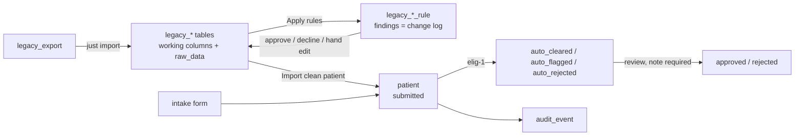

# Wellis Intake — patient intake & legacy migration

A patient information service for the Wellis take-home ([ASSIGNMENT.md](ASSIGNMENT.md)):
it imports the legacy export without destroying anything, runs new patient intakes
through a versioned eligibility engine, and gives the care team screens to work
what needs human eyes.

All patient data in this repository is synthetic.

- **Deployed:** _URL to be added at deploy_
- **Import report:** [IMPORT-REPORT.md](IMPORT-REPORT.md)
- **How the agents were directed:** [AGENT-NOTES.md](AGENT-NOTES.md), the workflow
  scripts in [`.claude/workflows/`](.claude/workflows/), and the session traces
- **Specs the code was built from:** [`notes/`](notes/) — `final-requirements.md`
  (Part A), `intake-requirements.md` (Part B), `rule-catalogue.md`, `deferred.md`

## What is built

| Part | Built | Not built |
|---|---|---|
| A — import & reconciliation | Idempotent import into raw-preserving legacy tables; 130 versioned rules; Apply rules; approve, decline, hand edit, reject; a per-row and per-rule change log; duplicate links with confirm and dismiss; rule revision from feedback; a preview of what a changed rule would do | Re-import of a corrected export (D4); undo of an accepted change (D2) |
| B — intake & eligibility | Multi-step intake form; eligibility ruleset `elig-1` with an explanation per rule; state machine enforced in the database; append-only audit log; legacy patients imported through the same evaluation | Authentication; clearing abandoned drafts |
| C — review console | Intake review queue and detail (both origins), with evaluation, status history and a required note on every decision; rules, rows and duplicates screens as the work surface for import conflicts | One combined queue across import conflicts and intakes; a side-by-side conflict view; one patient page joining the value log and the audit history |

## Running it

Needs Node 22 (see `.nvmrc`) and [`just`](https://github.com/casey/just).

```sh
nvm use
just install
cp .env.example .env
just import        # legacy_export/ → legacy tables in apps/api/data/dev.sqlite
just rules-sync    # rule catalogue in code → rule and rule_version tables
just dev           # API on PORT (3000 by default), web app on http://localhost:5173
```

Then open the Rules screen and press **Apply rules**.

| Command | |
|---|---|
| `just test` | backend test suite (Vitest, real temporary SQLite databases) |
| `just build` / `just lint` / `just format` | build, ESLint, Prettier |
| `just import <dir>` | import an export other than `legacy_export/` |
| `just revise queue` / `just revise apply <file>` | the rule revision queue, and applying one revision |
| `just rule-effects <ruleId>…` | what a rule's newest version would change, without writing |

`just build`, `just rules-sync`, `just revise` and `just rule-effects` rebuild the
API, so run them while `just dev` is stopped. If port 3000 is taken, change `PORT` and `VITE_API_BASE_URL`
together.

## Architecture



- **`apps/api`** — NestJS. `import` and `legacy` (legacy tables), `rules` (registry,
  runner, findings, approvals, declines, revisions, effects), `duplicates`, `rows`,
  `patient` and `intake` (main table, state machine, validation), `eligibility`,
  `consent`, `audit`, `review`, `legacy-patient-import`.
- **`apps/web`** — React, Vite, Mantine. `/rules`, `/rows`, `/duplicates`,
  `/review`, `/review/:id`, and the patient-facing `/intake`.
- **Database** — SQLite through `libsql`; one `DATABASE_URL` whose scheme picks a
  local file or Turso. TypeORM builds the schema on connect; there are no migrations
  because there is one final state.

## Schema

| Table | Holds |
|---|---|
| `legacy_patient`, `legacy_intake`, `legacy_consent` | Every exported row: working columns rules may change, and `raw_data`, the row exactly as it arrived, never written again |
| `legacy_patient_rule`, `legacy_intake_rule`, `legacy_consent_rule` | One finding per `(legacy id, rule, version, column)`: previous value, proposed value, `pending`/`approved`/`declined`, reason. An approved row is the record of a change |
| `rule`, `rule_version` | Rule metadata; exactly one active version per rule; `needs_review` and the reason a version was sent back |
| `duplicate` | A link between two legacy rows found by a duplicate rule: `pending`, `confirmed` or `dismissed` |
| `row_rejection` | A legacy row set aside as beyond repair |
| `patient` | The main table: intakes and imported legacy patients, `intake_status`, `ruleset_version`, the stored evaluation |
| `consent_event` | Append-only consent history per patient |
| `audit_event` | Append-only: who, when, from state, to state, reason |

## Key decisions

1. **Nothing is overwritten silently.** Import keeps the source row in `raw_data`.
   Rules only read and propose; a human approves; the approval and the data change
   are one transaction, and the approved finding is the log entry (which rule, which
   version, which column, from what, to what).
2. **Rules are code, versioned and frozen.** A rule is keyed by `(ruleId, version)`;
   a change is a new version, and old versions stay registered so the log keeps
   explaining itself.
3. **Ambiguous means no proposal.** 67 of the 130 rules find a problem they will not
   guess at (a date that reads both ways round, free-text medication). Those rows
   wait for a person, who types the value with a required note.
4. **Rules were written from `EXPORT-NOTES.md`, not from profiling the data**, so the
   fixes are not fitted to the rows that happened to be looked at. The data decided
   which rules were right, through approvals and declines.
5. **Declines are permanent and feed back.** A declined row is never raised again by
   any version. Declining a whole rule parks its version in a revision queue; the
   revise workflow writes the next version, and `rule-effects` shows what it would
   change before anyone presses Apply rules.
6. **Duplicates are links, not merges.** A rule proposes a pair; a person confirms or
   dismisses it. Confirming a patient link rejects the duplicate row, and merge rules
   fill the survivor's empty columns through the normal approval path.
7. **A fix may span two columns** when either alone would leave the row wrong —
   converting pounds writes the weight and the unit, approved or declined together.
8. **Manual changes carry a note.** A hand edit is recorded as a finding under a
   reserved rule id, so every change has the same shape in the log.
9. **One evaluation for both ways in.** A clean legacy patient becomes a `submitted`
   patient and runs through `elig-1` like an intake. A missing answer flags rather
   than clears; a missing BMI or revoked consent rejects; a pending duplicate link
   blocks import.
10. **Illegal transitions are impossible, not avoided.** One transition table, a
    conditional `UPDATE … WHERE intake_status = :from`, and SQLite triggers that
    refuse any illegal pair even from raw SQL. Audit rows are written in the same
    transaction and triggers refuse updates and deletes on them.
11. **Eligibility is versioned and explained.** Each patient stores `ruleset_version`
    and every rule's result, matched or not, with a sentence a reviewer can read.
    BMI is compared rounded, so 26.96 is not shown as 27.0 and rejected.

## Scope cuts

- **Frontend tests (D1).** The parts that must be provably correct — eligibility,
  the state machine, import and the rules engine — are backend and tested there
  (179 spec files, 1,074 tests).
- **Undo of an accepted change (D2).** It would make every row a derivation of its
  history; the log records which version made each change instead.
- **Rules interacting with each other (D3).** Not expected; handled if it happens.
- **Re-import of a corrected export (D4).** The importer skips ids already present;
  update-or-merge semantics are a feature of their own.
- **Showing a two-column fix as one line on screen.** Approve and decline already act
  on both columns together.
- **Part C's combined queue, conflict view and patient page.** The queue, decision
  and log each exist per source; joining them is the next piece of work.
- **Authentication.** Staff type their name, which becomes the audit actor.
- **Open data question:** a weight with no unit. P47 is in the revision queue; the
  18 such rows wait for a person, and a blank unit fails import.

## Deploying

The deployed instance is seeded from a locally built database: run the import, sync
the rules, apply them and make decisions locally, then upload
`apps/api/data/dev.sqlite` to Turso. Set `DATABASE_URL` to the `libsql://` URL and `TURSO_AUTH_TOKEN`; nothing
else changes. The web app needs `VITE_API_BASE_URL` pointed at the deployed API.
